# 📖 Blog App

## 🚀 Overview
Blog App is a Flutter-based blogging application that allows users to create accounts, post blogs, view and interact with other users' blogs, edit and delete their own posts, and follow other users. The project is designed to showcase the implementation of **Clean Architecture** and **SOLID principles**.

## ✨ Features
- ✅ User authentication (Signup, Login, Logout)
- 📝 Create, edit, and delete blogs
- ❤️ Like and interact with other users' blogs
- 👤 Edit profile, including profile picture update
- 🔗 Follow/unfollow other users
- ❓ FAQ section
- 🏗 Uses **Supabase** as the backend
- 📡 Offline storage (In Progress)

## 🛠 Installation
### Prerequisites
- Flutter installed on your system
- A Supabase project with API keys

### Steps
1. Clone the repository:
   ```sh
   git clone https://github.com/yourusername/blog-app.git
   cd blog-app
   ```
2. Install dependencies:
   ```sh
   flutter pub get
   ```
3. Create a folder `lib/core/secrets/` and inside it, create a file `secrets.dart`.
4. Add your **Supabase API keys** in `lib/core/secrets/secrets.dart` as follows:
   ```dart
   class Secrets {
       static const String supabaseUrl = "YOUR_SUPABASE_URL";
       static const String supabaseAnonKey = "YOUR_SUPABASE_ANON_KEY";
   }
   ```
5. Run the app:
   ```sh
   flutter run
   ```

## 🔧 Supabase Setup
- The **Supabase API keys** must be placed in `secrets.dart`.
- To enable the **delete user** feature, you need to either:
  - Use an **admin instance**, or
  - Set up a **custom backend**.

## 📸 Screenshots

### 🔐 Login/SignUp Screen  
<p align="center">
  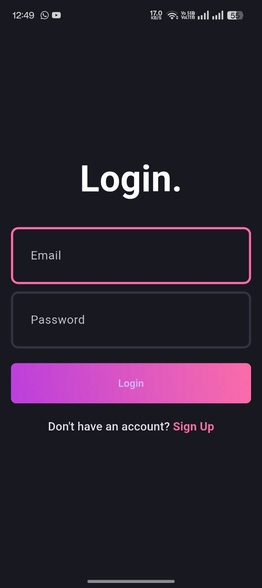
  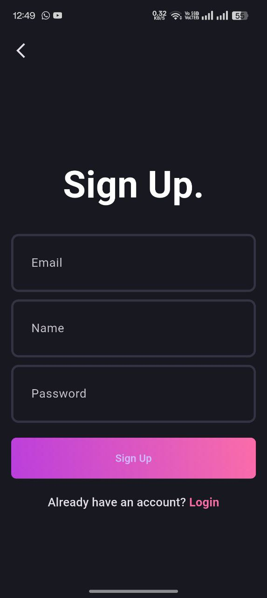
</p>

### 🏠 Home Page  
<p align="center">
  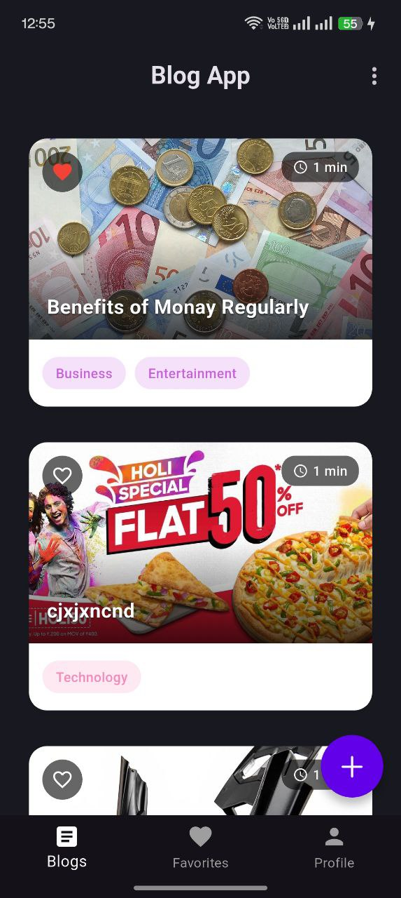
</p>

### ✍️ Create/Edit Blog  
<p align="center">
  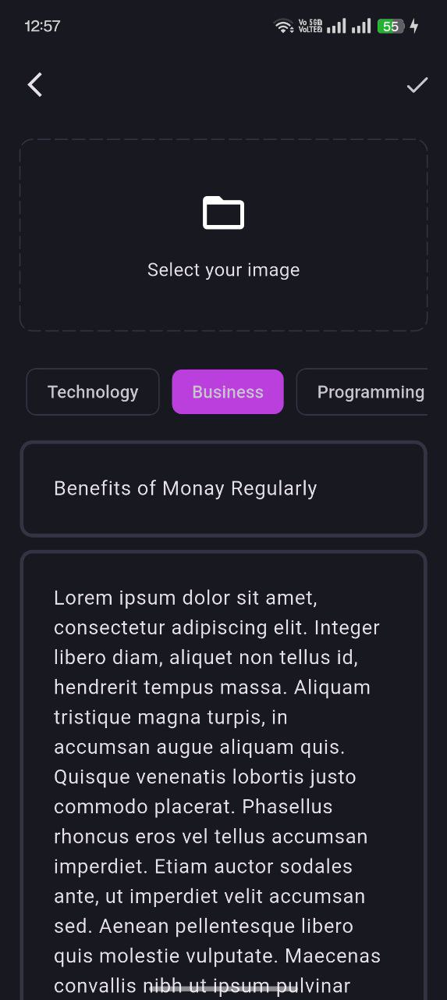
</p>

### 👤 Profile Page  
<p align="center">
  
  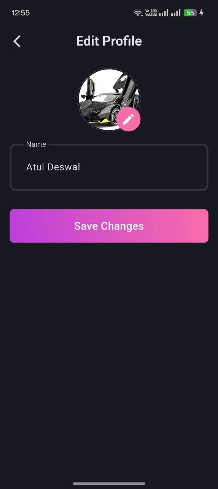
</p>

### 🔍 Own Blog Details/Other's Blog Details  
<p align="center">
  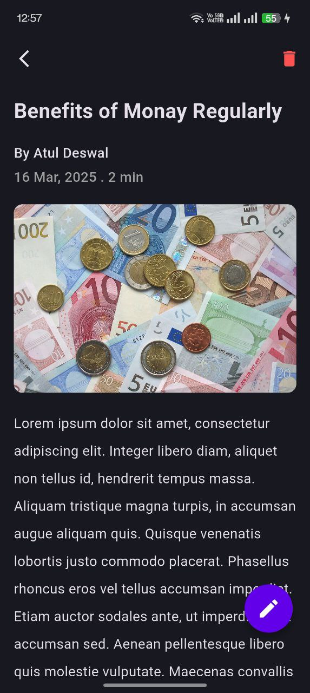
  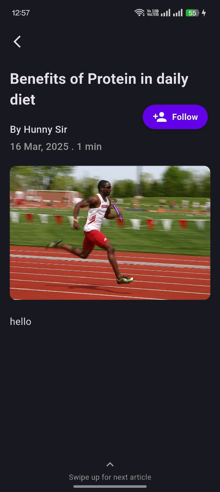
</p>

### ❤️ Favorite's Page  
<p align="center">
  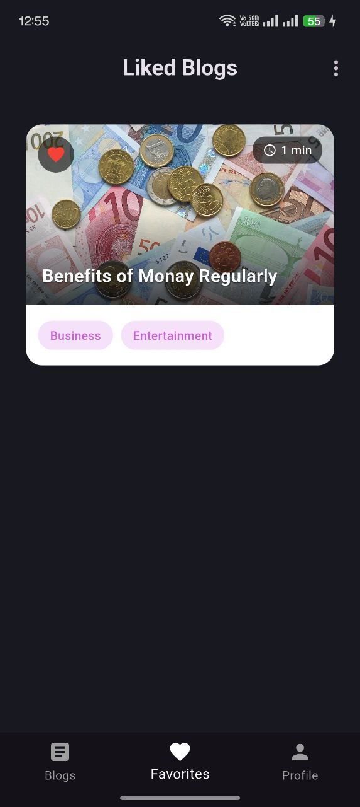
</p>

### ℹ️ About Page  
<p align="center">
  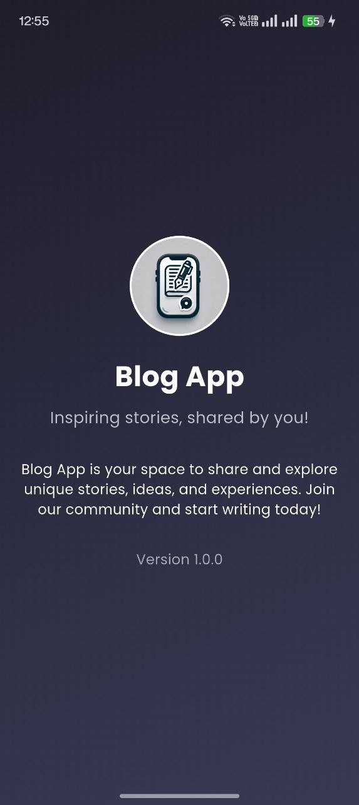
</p>

### ⚙️ Settings Page  
<p align="center">
  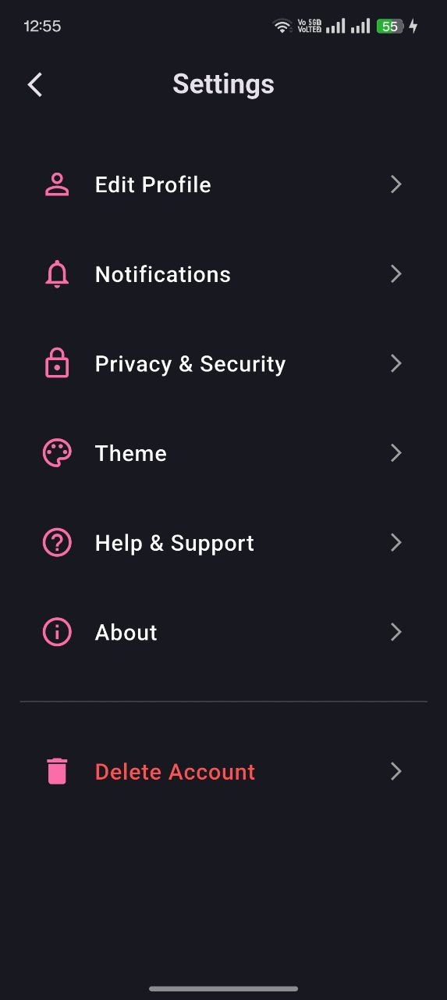
  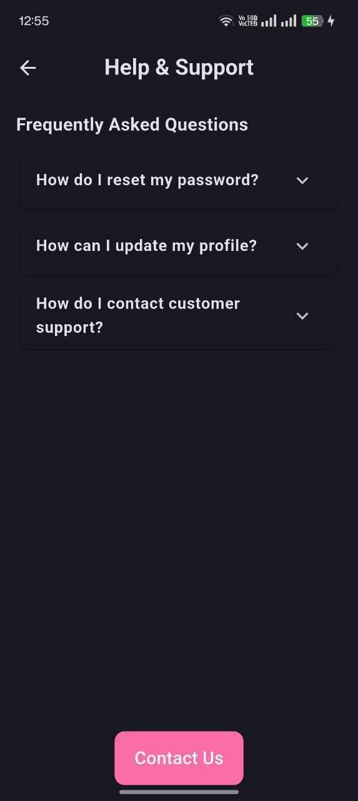
</p>


## 📜 License
This project is licensed under the **MIT License**. See the [LICENSE](LICENSE) file for more details.
